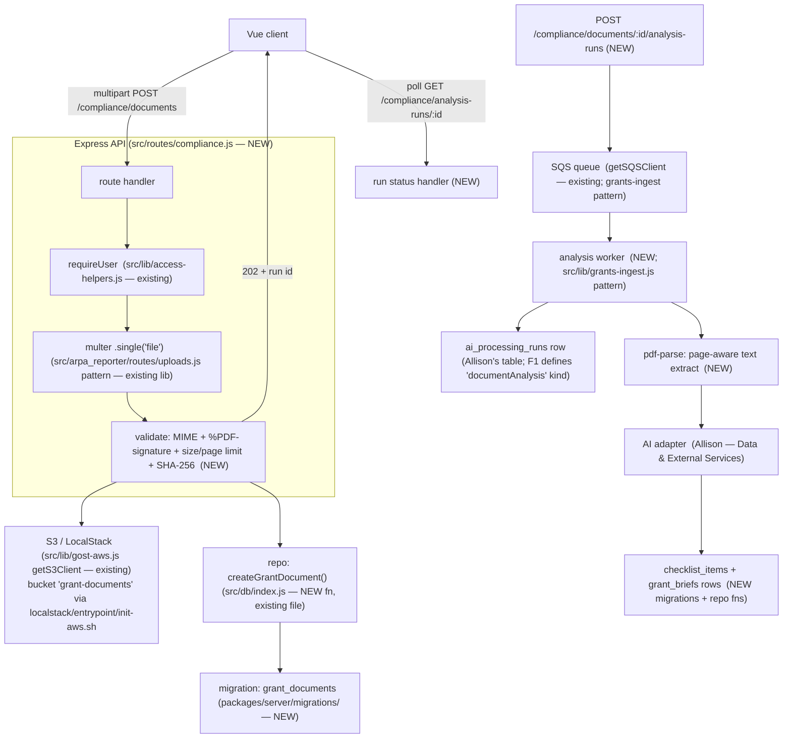

# G32 F1 Upload and Analysis Integration Points

**Task:** AN-02 Identify upload and analysis integration points
**Owner:** Anthony Karoussos
**Version:** 1.0
**Date:** September 9, 2026
**Applies to:** F1 (Grant Analysis and Compliance Checklist) subsystem, GOST server (`packages/server/`)

## Purpose

Pin down exactly where the F1 subsystem attaches to the existing GOST codebase, so implementation follows GOST's existing patterns instead of adding a parallel layer. Implements the contract defined in `docs/g32-shared-api-contracts.md`.

Repo: `GOST-Capstone-2026/usdr-gost-capstone`. All paths below are under `packages/server/`.

---

## Integration map (summary)



Legend: **NEW** = F1 code I write · **existing** = GOST code/library I reuse unchanged.

---

## 1. Route registration

**File:** `src/configure.js` → function `configureApiRoutes(app)` (lines ~13-26).

Every API area is one line: `app.use('<url prefix>', require('./routes/<file>'))`.

**F1 change:** add one line, per Connor's C-02 contract (`/compliance` namespace):
```js
app.use('/api/organizations/:organizationId/compliance', require('./routes/compliance'));
```
**New file(s):** `src/routes/compliance.js` (or a `src/routes/compliance/` folder split by resource — documents, briefs, checklist).

## 2. Authentication & organization scoping

**File:** `src/lib/access-helpers.js` — already written, do not modify.

- Import `requireUser` and pass it as the first middleware on every route:
  `router.post('/documents', requireUser, ...handler)`
- After it runs, the handler has `req.session.user` (id, tenant_id, agency_id, role_name) and `req.session.selectedAgency`.
- `requireUser` already 403s a `staff` user hitting an org that isn't theirs.
- **Contract rule #4:** the handler must also verify `req.params.organizationId` belongs to `req.session.user.tenant_id` — never trust an org/tenant id from the request body. Use `isUserAuthorized(user, agencyId)` (also exported from access-helpers) or the tenant check pattern already in `routes/grants.js`.
- Records outside the tenant → `404` (don't leak existence); inaccessible org route → `403` (matches existing GOST behavior).

## 3. PDF file upload

**Library:** `multer` — already a dependency (`packages/server/package.json`).
**Pattern to copy:** `src/arpa_reporter/routes/uploads.js`:
```js
const multer = require('multer');
const multerUpload = multer({ storage: multer.memoryStorage() });
// ...
router.post('/documents',
  requireUser,
  ensureAsyncContext(multerUpload.single('file')),   // wrapper works around multer bug expressjs/multer#814
  async (req, res) => {
    // req.file.buffer, req.file.originalname, req.file.mimetype, req.file.size
    // req.body.grantId, req.body.sourceUrl
  });
```
`ensureAsyncContext` is at `src/arpa_reporter/lib/ensure-async-context.js`.

**Contract requirements for the upload handler (Grant Document Contract):**
- `multipart/form-data`; `file` (required PDF), `grantId` (required, must be an existing grant), `sourceUrl` (optional).
- Verify **MIME type AND the PDF file signature** (`%PDF-` magic bytes) — don't trust filename/MIME alone.
- Enforce configured **size limit** (→ `413`) and **page limit**; reject non-PDF (→ `415`).
- Compute **SHA-256** of the file and store it.
- Store the file as an **organization-scoped object**; never return bucket name / object key / credentials to the browser.

## 4. Where the PDF bytes get stored

Two existing precedents in GOST:

| Approach | Where | Notes |
|---|---|---|
| **S3 (via LocalStack locally)** | `src/lib/gost-aws.js` → `getS3Client()` | Auto-points at LocalStack when `LOCALSTACK_HOSTNAME` is set (it is, in `.env`). Existing bucket: `arpa-audit-reports`. F1 should get its own bucket (e.g. `grant-documents`) added to `localstack/entrypoint/init-aws.sh`. This matches the C-02 contract and my technical design. |
| **Local disk** | `src/arpa_reporter/services/persist-upload.js` → `uploadFSName()` writes to `UPLOAD_DIR` | ARPA reporter actually stores uploads on disk, not S3. Simpler, but not what the contract calls for. |

**Decision:** S3 via `getS3Client()`, own bucket, object key includes the org id. Coordinate the bucket name + init script change with Allison (she owns Data & External Services / `init-aws.sh`).

## 5. Database migrations

**Folder:** `packages/server/migrations/`. Filename: `YYYYMMDDHHMMSS_description.js`. Run: `docker compose exec app yarn db:migrate`.
**Pattern:** `20240804181729_create_grant_followers.js` — `exports.up` uses `knex.schema.createTable(...)`, `exports.down` drops it. `table.increments('id').primary()`, `table.foreign(...).references(...).inTable(...)`, `table.timestamp('created_at').defaultTo(knex.fn.now())`.

**F1 tables I own** (per C-02 "Database Mapping Baseline"): `grant_documents`, `checklist_items`, and `grant_briefs` (or a versioned structured result linked to `grant_documents`). `ai_processing_runs` is Allison's but F1 writes to it.

### ⚠️ Coordination: Manuel's placeholder `checklist_items`
Manuel's **PR #2** (`feat/m01-verify-GOST-and-create-seeded-deadline-examples`) adds a table **`checklist_items_placeholder`** so the deadline tracker (F5) can develop before F1 exists. Differences from my real design / the C-02 contract:
- named `checklist_items_placeholder`, keyed on `agency_id` (not `document_id`)
- `completion_status` default `'open'` (contract wants `notStarted` / `inProgress` / `completed` / `notApplicable`)
- no `found`, `source_*`, `possibly_affected_by_quality_issue`, `due_date` handling beyond a bare column, no `version`

**My real `checklist_items`** (AN-11 / AN-12) needs, per contract + my tech design:
`document_id` FK → `grant_documents`, `grant_id`, `organization_id` (or via FK path), `category` (enum: eligibility, applicationMaterial, submission, costShare, reporting, recordRetention, deadline, other), `description`, `found` (bool), source refs (page number 1-based + exact excerpt, per Source Traceability Contract), `possibly_affected_by_quality_issue` (bool), `due_date` (date, no TZ), `completion_status` (enum above), `user_notes`, `is_user_edited` (bool), `verification_status` (unverified/verified/rejected), `verified_by`, `verified_at`, `version` (int, optimistic locking), timestamps.
→ When my real table lands, Manuel switches F5 off the placeholder. Flag this to him now.

## 6. Database access layer (repository functions)

**File:** `src/db/index.js` — plain async functions (`getGrants()`, `getUsers()`, …) that run SQL via `knex` and return rows. `src/db/connection.js` is the shared `knex` instance.
**F1 adds:** `createGrantDocument()`, `getGrantDocument()`, `getChecklistItemsForDocument()`, `updateChecklistItem()`, etc. — same style.
**Contract naming rule:** API JSON is `camelCase`; Postgres columns stay `snake_case`; the repository function maps between them.

## 7. Background / async processing (the "runs" model)

**Contract:** long AI operations don't block the HTTP request. `POST .../analysis-runs` returns **`202`** immediately with a `run` record (status `queued`); a worker picks it up; the client polls `GET .../analysis-runs/:runId`. States: `queued → processing → (reviewRequired) → completed | failed`. Retry = new run row, `attempt++`, `parentRunId` set. A failed run never overwrites a prior completed result.

**Existing GOST precedent for queue workers:**
- `src/lib/grants-ingest.js` and `src/scripts/consumeGrantModifications.js` read from an SQS queue.
- Queue URLs already in `.env`: `GRANTS_INGEST_EVENTS_QUEUE_URL`, `TASK_QUEUE_URL`, etc. (LocalStack SQS locally).
- SQS client: `src/lib/gost-aws.js` → `getSQSClient()`.

**F1 worker:** new `documentAnalysis` run kind. Worker reads a queue → runs `pdf-parse` (page-aware text extraction) → calls the AI adapter (Allison's) for structured extraction → writes `grant_briefs` + `checklist_items` → marks the run `completed` in one DB transaction.
**Note:** `ai_processing_runs` table + the AI adapter are Allison's ("Allison with all subsystem owners"). F1 defines the `documentAnalysis` run shape and consumes the adapter.

## 8. Frontend (later — AN-15/AN-16, not this task)

`packages/client/src/views/` for pages; the C-02 contract references a `fetchApi` helper and Vuex stores keyed by organization. UI polls the run `self` link while `queued`/`processing`, shows `reviewRequired` as a distinct state, never derives ownership/verification/audit fields itself.

---

## The F1 endpoints I'm building (target list, from C-02 "Grant Document" + "Grant Brief" + "Checklist" contracts)

| Method | Route (under `/api/organizations/:organizationId/compliance`) | Purpose |
|---|---|---|
| `POST` | `/documents` | Upload one PDF, link to a grant |
| `GET` | `/documents/:documentId` | Document metadata + latest processing state |
| `POST` | `/documents/:documentId/analysis-runs` | Start extraction → brief → checklist |
| `GET` | `/analysis-runs/:runId` | Poll processing state |
| `GET` | `/documents/:documentId/brief` | The one-screen grant brief |
| `GET` | `/documents/:documentId/checklist-items` | The checklist |
| `PATCH` | `/checklist-items/:itemId` | Edit / annotate / verify / reject / update completion |
| `GET` | `/documents/:documentId/checklist-export` | Download readable export |

## Handoffs (from C-02 "Team Handoffs")
- **In:** Connor's matcher → my document workflow: passes `organizationId`, `grantId`, `sourceUrl`, available document metadata.
- **In:** Allison's AI adapter → me: structured response + model/prompt versions + safe provider error.
- **Out:** my verified checklist items (with `dueDate` + source ref) → Manuel's portfolio/deadline view.

## Status update (2026-09-12)

AN-03 (`POST /documents` — authorized PDF upload + validation: MIME + `%PDF-` signature + size/page limits + SHA-256, stored to S3, `grant_documents` row created) has been implemented and manually verified end-to-end. See branch `an03-grant-document-upload-v2` and `AN-03_Verification.md`. This covers steps 1–6 of the F1 pipeline (upload → auth check → catch the file → validate → save → respond). Steps 7+ (text extraction, AI analysis, checklist generation) are tracked in later AN tasks (AN-04 onward).
